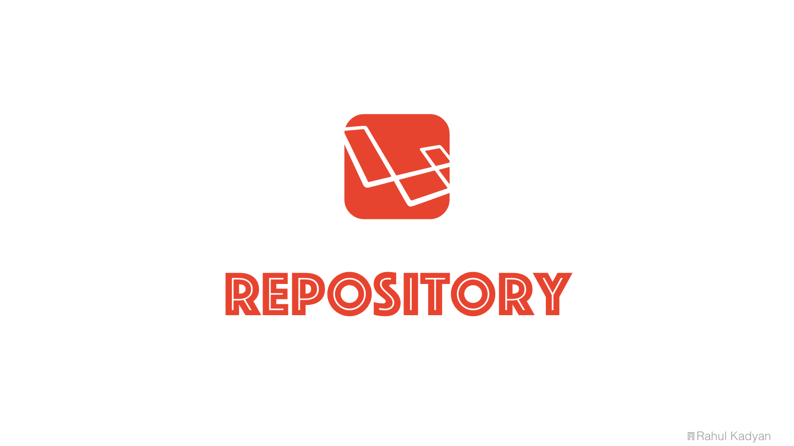

Repository
==========
Don't use your Eloquent models directly into your controllers, instead create a repository.

  
  
  
  
  
  

  

## Docs
See [znck.me/repository](http://znck.me/repositiory).

## Change log

Please see [releases](https://github.com/znck/repository/releases) for more information what has changed recently.

## Contributing

Please see [CONTRIBUTING](CONTRIBUTING.md) and [CONDUCT](CONDUCT.md) for details.

## Security

If you discover any security related issues, please email hi@znck.me instead of using the issue tracker.

## Credits

- [Rahul Kadyan][link-author]
- [All Contributors][link-contributors]

## License

The MIT License (MIT). Please see [License File](LICENSE) for more information.

[link-author]: https://github.com/znck
[link-contributors]: ../../contributors
